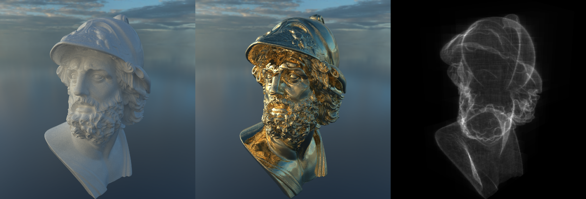

# Path Tracer

This work is in progress.

Basic C++ path tracer with bounding volume hierarchy (BVH) based on [the tutorial series by jbikker](https://jacco.ompf2.com/2022/04/13/how-to-build-a-bvh-part-1-basics/)

    

["Bust of Menelaus"](https://www.myminifactory.com/object/3d-print-bust-of-menelaus-32197) by Scan The World

Environment map from [HDR Haven](https://hdri-haven.com/)

## Features

- BVH construction and traversal
- Cook-Torrance
- Trowbridge-Reitz (GGX) specular
- Lambertian diffuse
- BRDF importance sampling

## Dependencies

- [GLM](https://github.com/g-truc/glm) for maths functions and data structures
- [stb](https://github.com/nothings/stb) for reading and writing images
- [stl_reader.h](https://github.com/sreiter/stl_reader) for reading STL files
