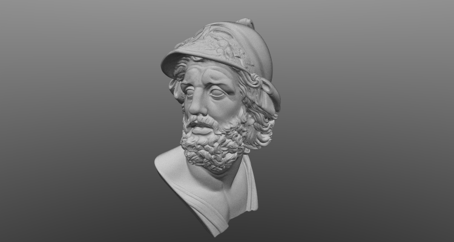

# Path Tracer

This work is in progress.

Basic C++ path tracer with bounding volume hierarchy (BVH) following [the tutorial series by jbikker](https://jacco.ompf2.com/2022/04/13/how-to-build-a-bvh-part-1-basics/)

    

["Bust of Menelaus" by Scan The World](https://www.myminifactory.com/object/3d-print-bust-of-menelaus-32197)

## Features

- BVH construction and traversal
- Cooke-Torrance
- Trowbridge-Reitz specular
- Lambertian diffuse
- Importance sampling

## Dependencies

- [GLM](https://github.com/g-truc/glm) for maths functions and data structures
- [stb_image_write.h](https://github.com/nothings/stb) for writing images
- [stl_reader.h](https://github.com/sreiter/stl_reader) for reading STL files
