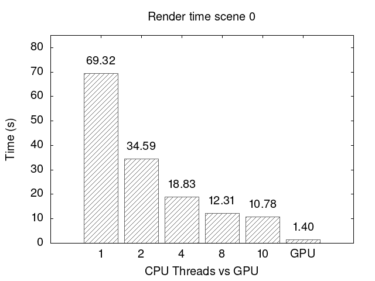

# Path Tracer

This work is in progress.

CUDA / C++ path tracer with bounding volume hierarchy (BVH) based on [the tutorial series by jbikker](https://jacco.ompf2.com/2022/04/13/how-to-build-a-bvh-part-1-basics/)

[Pure C++ version for CPU](https://github.com/al-ro/path-tracer/tree/main)

### Test scenes

<table width="100%">
  <thead>
    <tr>
      <th width="50%">Scene 0: 3 instances</th>
      <th width="50%">BVH heat map (max 267)</th>
    </tr>
  </thead>
  <tbody>
    <tr>
      <td width="50%"></td>
      <td width="50%"></td>
    </tr>
  </tbody>
</table>

<table width="100%">
  <thead>
    <tr>
      <th width="50%">Scene 1: 10,000 instances</th>
      <th width="50%">BVH heat map (max 600)</th>
    </tr>
  </thead>
  <tbody>
    <tr>
      <td width="50%"></td>
      <td width="50%"></td>
    </tr>
  </tbody>
</table>

<table width="100%">
  <thead>
    <tr>
      <th width="50%">Scene 2: Model with vertex attributes</th>
      <th width="50%">BVH heat map (max 123)</th>
    </tr>
  </thead>
  <tbody>
    <tr>
      <td width="50%"></td>
      <td width="50%"></td>
    </tr>
  </tbody>
</table>

|| triangles per mesh | BLAS | time (s) | TLAS | total triangles | max tests
:---:|:---:|:---:|:---:|:---:|:---:|:---:|
Scene 0 | 505,848 | 792,591 | 0.88 | 5 | 1,517,544 | 267
Scene 1 | 505,848 | 792,591 | 0.88 | 19,819 | 5,058,480,000 | 600
Scene 2 | 3,828 | 4,899 | 0.0049 | 1 | 3,828 | 123

### Performance

- Resolution: 1500 x 800
- Samples: 100
- Max bounces: 6
- CPU: 13th Gen Intel Core i7-13700H × 20
- GPU: NVIDIA GeForce RTX 3050 6GB

<table width="100%">
  <tbody>
    <tr>
      <td width="50%"></td>
      <td width="50%"></td>
    </tr>
  </tbody>
</table>

<table width="100%">
  <tbody>
    <tr>
      <td width="50%"></td>
      <td width="50%"></td>
    </tr>
  </tbody>
</table>

<table width="100%">
  <tbody>
    <tr>
      <td width="50%"></td>
      <td width="50%"></td>
    </tr>
  </tbody>
</table>

["Bust of Menelaus"](https://www.myminifactory.com/object/3d-print-bust-of-menelaus-32197) by Scan The World

["Viking room"](https://sketchfab.com/3d-models/viking-room-a49f1b8e4f5c4ecf9e1fe7d81915ad38) by nigelgoh (edited)

Environment map from [HDR Haven](https://hdri-haven.com/)

## Features

- BVH (BLAS + TLAS) construction and traversal
- Cook-Torrance
- Trowbridge-Reitz (GGX) specular
- Lambertian diffuse
- BRDF importance sampling

## Use

Running outputs parameters and progress to the console

Resulting image is output as *output.bmp*

- make clean (to remove old executable)
- make build
- make run (with default settings)
- make all (clean, build, run)
- `./PathTracer <options>`
    - `-d` 0: CUDA (default), 1: CPU
    - `-w` width of rendered image (e.g. -w 512)
    - `-h` height of rendered image
    - `-s` samples per pixel
    - `-b` maximum bounces per ray per sample
    - `-t` number of threads (ignored when using CUDA)
    - `-p` preset scene \[0, 2\]
    - `-a` output BVH heatmap (ignores `-s` and `-b`)

## Dependencies

- [GLM](https://github.com/g-truc/glm) for maths functions and data structures
- [stb](https://github.com/nothings/stb) for reading and writing images (included in /lib)
- [stl_reader](https://github.com/sreiter/stl_reader) for reading STL files (included in /lib)
- [tinyobjloader](https://github.com/tinyobjloader/tinyobjloader) for loading OBJ files (included in /lib)
- C++17
- make (optional)
